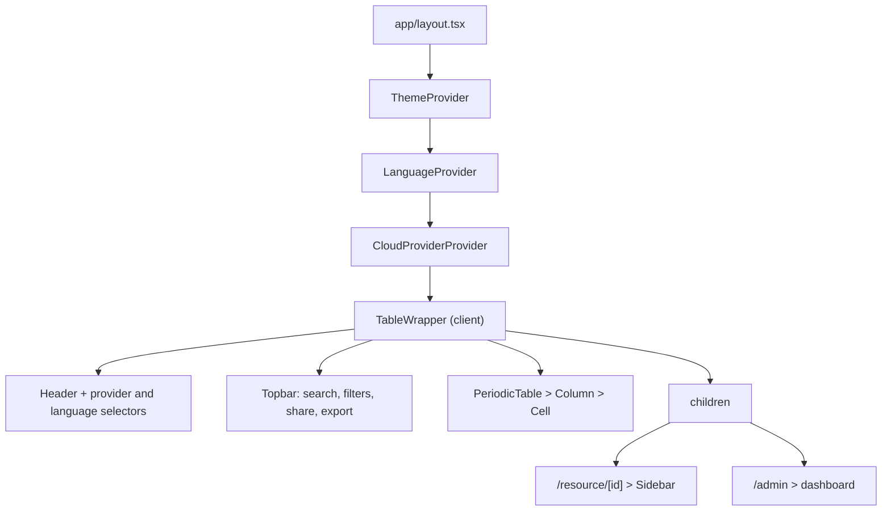
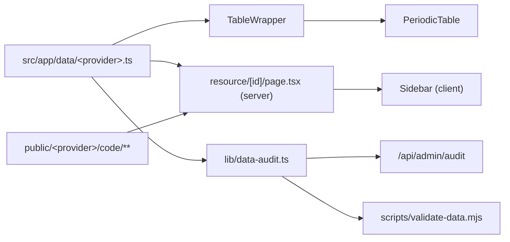

# Architecture

## The page is rendered by the layout

`src/app/page.tsx` is an empty fragment. The whole table lives in the root
layout, which wraps `{children}` in the theme, language and cloud provider
providers, then in `TableWrapper`.

`NavigationProgress` sits at the same level: the App Router exposes no
navigation events in Next 13, so it watches link clicks and completes when the
pathname changes. Combined with `resource/[id]/loading.tsx`, which renders a
skeleton sidebar, it removes the "frozen page" effect while a server component
is being rendered.

Two consequences:

- Clicking a cell is a **shallow navigation**: `/resource/[id]` renders the
  sidebar *on top of* the table, which stays mounted. `ConditionalLink`
  (`src/lib/ConditionalLink.tsx`) wraps every cell.
- A standalone page such as `/admin` has to opt out. `TableWrapper` checks the
  pathname and renders only `children` for those routes.

## Data flow

- Every provider module exports the same three things: `Item`, `ColumnType` and
  `columns`. The types are duplicated verbatim in each file; the rest of the
  application imports them from `@/app/data/azure`.
- `columns` **is** the visual layout: one entry per vertical column, in render
  order.
- The resource route resolves the id across all providers, then overrides the
  code snippets with the files found under `public/<provider>/code/`.
- The audit rules are written once and consumed both by the API route (with the
  filesystem check for icons) and by the CLI, which loads the TypeScript
  through `scripts/lib/load-ts.mjs`.

## Directory map

| Path | Role |
| --- | --- |
| `src/app/data/` | One dataset per provider. |
| `src/app/constants.ts` | `Categories` enum and `ENABLE_CHAT`. |
| `src/config.ts` | Site configuration, social links, category colours. |
| `src/i18n/` | Dictionaries and language context. |
| `src/lib/data-audit.ts` | Dataset rules shared by the dashboard and the CLI. |
| `src/lib/logger.ts` | Leveled logger driven by `NEXT_PUBLIC_LOG_LEVEL`. |
| `src/components/` | UI, including `table-wrapper.tsx` and `sidebar.tsx`. |
| `scripts/` | Node CLIs: data checks, resource and provider scaffolding, dependencies. |
| `python/` | Terraform snippet collectors. |
| `public/<provider>/` | Icons and generated code snippets. |
